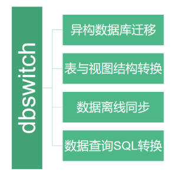

# 异构数据库数据与结构同步程序

## 一、支持功能

  oracle/SqlServer/mysql/PostgreSQL表结构及数据向Greenplum/PostgreSQL数据库的迁移(表结构+表数据)同步功能。示例如如下：
  
  
 

## 二、编译配置

本工具纯Java语言开发，环境要求、编译方法及其配置方式如下：

### 1、编译打包

- 环境要求:

 **JDK**:>=1.8
 
 **maven**:>=3.6
 
- 编译命令:

```
git clone https://gitee.com/inrgihc/dbswitch.git
cd dbswitch/
sh ./build.sh
```

### 2、安装部署

当编译打包命令执行完成后，会在dbswitch/target/目录下生成dbswitch-relase-x.x.x.tar.gz的打包文件，将文件拷贝到部署机器上解压即可。

### 3、配置文件

配置文件信息如下：vim conf/config.properties

| 配置参数 | 配置说明 | 示例 | 备注 |
| :------:| :------: | :------: | :------: |
| source.datasource.url | 来源端JDBC连接的URL | jdbc:oracle:thin:@172.17.1.158:1521:ORCL | 可为：oracle/mysql/sqlserver/postgresql |
| source.datasource.driver-class-name | 来源端数据库的驱动类名称 | oracle.jdbc.driver.OracleDriver | 对应数据库的驱动类 |
| source.datasource.username | 来源端连接帐号名 | tangyibo | 无 |
| source.datasource.password | 来源端连接帐号密码 | tangyibo | 无 |
| target.datasource.url | 目的端JDBC连接的URL | jdbc:postgresql://172.17.1.90:5432/study | 可为：oracle/postgresql/greenplum |
| target.datasource.driver-class-name |目的端 数据库的驱动类名称 | org.postgresql.Driver | 对应数据库的驱动类 |
| target.datasource.username | 目的端连接帐号名 | study | 无 |
| target.datasource.password | 目的端连接帐号密码 | 123456 | 无 |
| source.datasource-fetch.size | 来源端数据库查询时的fetch_size设置 | 10000 | 需要大于100有效 |
| source.datasource-source.schema | 来源端的schema名称 | ZFXFZB | 无 |
| source.datasource-source.includes | 来源端schema下的表中需要包含的表名称 | users1,orgs1 | 多个之间用英文逗号分隔 |
| source.datasource-source.excludes | 来源端schema下的表中需要过滤的表名称 | users,orgs | 不包含的表名称，多个之间用英文逗号分隔 |
| target.datasource-target.schema | 目的端的schema名称 | public | 无 |
| target.datasource-target.drop | 是否执行先drop表然后create表命令 | true | 可选值为：true、false |
| target.writer-engine.insert | 是否使用insert写入数据 | true | 可选值为：true为insert写入、false为copy写入，只针对目的端数据库为PostgreSQL/Greenplum的有效 |

> **注意**：（1）如果source.datasource-source.includes不为空，则按照包含表的方式来执行；（2）如果source.datasource-source.includes为空，则按照source.datasource-source.excludes排除表的方式来执行。

- mysql的配置样例

```
# source database connection information
source.datasource.url= jdbc:mysql://172.17.207.210:3306/test?useUnicode=true&characterEncoding=utf-8&useSSL=true&zeroDateTimeBehavior=convertToNull&serverTimezone=Asia/Shanghai
source.datasource.driver-class-name= com.mysql.cj.jdbc.Driver
source.datasource.username= tangyibo
source.datasource.password= tangyibo

# target database connection information
target.datasource.url= jdbc:postgresql://172.17.207.90:5432/study
target.datasource.driver-class-name= org.postgresql.Driver
target.datasource.username= study
target.datasource.password= 123456

# source database configuration parameters
## fetch size for query source database
source.datasource-fetch.size=10000
## schema name for query source database
source.datasource-source.schema=test
## table name include from table lists
source.datasource-source.includes=
## table name exclude from table lists
source.datasource-source.excludes=users,orgs

# target database configuration parameters
## schema name for create/insert table data
target.datasource-target.schema=public
## whether drop-create table when target table exist
target.datasource-target.drop=true
## whether use insert engine to write data for target database
## Only usefull for PostgreSQL/Greenplum database
target.writer-engine.insert=false
```

- oracle的配置样例

```
# source database connection information
source.datasource.url= jdbc:oracle:thin:@172.17.207.158:1521:ORCL
source.datasource.driver-class-name= oracle.jdbc.driver.OracleDriver
source.datasource.username= ZFXFZB
source.datasource.password= ZFXFZB

# target database connection information
target.datasource.url= jdbc:postgresql://172.17.207.90:5432/study
target.datasource.driver-class-name= org.postgresql.Driver
target.datasource.username= study
target.datasource.password= 123456

# source database configuration parameters
## fetch size for query source database
source.datasource-fetch.size=10000
## schema name for query source database
source.datasource-source.schema=ZFXFZB
## table name include from table lists
source.datasource-source.includes=
## table name exclude from table lists
source.datasource-source.excludes=users,orgs

# target database configuration parameters
## schema name for create/insert table data
target.datasource-target.schema=public
## whether drop-create table when target table exist
target.datasource-target.drop=true
## whether use insert engine to write data for target database
## Only usefull for PostgreSQL/Greenplum database
target.writer-engine.insert=false
```

- SqlServer的配置样例
```
# source database connection information
source.datasource.url= jdbc:sqlserver://172.16.90.166:1433;DatabaseName=hqtest
source.datasource.driver-class-name= com.microsoft.sqlserver.jdbc.SQLServerDriver
source.datasource.username= hqtest
source.datasource.password= 123456

# target database connection information
target.datasource.url= jdbc:postgresql://172.17.207.90:5432/study
target.datasource.driver-class-name= org.postgresql.Driver
target.datasource.username= study
target.datasource.password= 123456

# source database configuration parameters
## fetch size for query source database
source.datasource-fetch.size=10000
## schema name for query source database
source.datasource-source.schema=dbo
## table name include from table lists
source.datasource-source.includes=
## table name exclude from table lists
source.datasource-source.excludes=users,orgs

# target database configuration parameters
## schema name for create/insert table data
target.datasource-target.schema=public
## whether drop-create table when target table exist
target.datasource-target.drop=true
## whether use insert engine to write data for target database
## Only usefull for PostgreSQL/Greenplum database
target.writer-engine.insert=false
```

- PostgreSQL的配置样例
```
# source database connection information
source.datasource.url= jdbc:postgresql://172.17.207.210:5432/tangyibo
source.datasource.driver-class-name= org.postgresql.Driver
source.datasource.username= tangyibo
source.datasource.password= tangyibo

# target database connection information
target.datasource.url= jdbc:postgresql://172.17.207.90:5432/study
target.datasource.driver-class-name= org.postgresql.Driver
target.datasource.username= study
target.datasource.password= 123456

# source database configuration parameters
## fetch size for query source database
source.datasource-fetch.size=10000
## schema name for query source database
source.datasource-source.schema= public
## table name include from table lists
source.datasource-source.includes=
## table name exclude from table lists
source.datasource-source.excludes=users,orgs

# target database configuration parameters
## schema name for create/insert table data
target.datasource-target.schema=public
## whether drop-create table when target table exist
target.datasource-target.drop=true
## whether use insert engine to write data for target database
## Only usefull for PostgreSQL/Greenplum database
target.writer-engine.insert=false
```

启动执行命令如下：
```
cd dbswitch-release-0.0.1/
bin/datasync.sh
```

### 4、特别说明

- (1)对于向目的库为PostgreSQL/Greenplum的数据离线同步默认采用copy方式写入数据，注意事项如下：
  
  **（a）** 如若使用copy方式写入，配置文件中需配置为postgresql的jdbcurl和驱动类（不能为greenplum的驱动包），
  
  **（b）** 如若使用insert方式写入，需要在config.properties配置文件中设置如下参数为true:

```
target.writer-engine.insert=true
```

- (2)dbswitch离线同步工具支持来源库为oracle/mysql/sqlserver/postgresql;

- (3)dbswitch离线同步工具支持目的库为oracle/postgresql/greenplum;
 
- (4)dbswitch离线同步工具提供各种数据库间表结构转换RESTful类型的API接口，服务启动方式如下：
 
 ```
cd dbswitch-release-0.0.1/
bin/startup.sh
```

提供swagger在线接口文档：htttp://127.0.0.1:9088/swagger-ui.html

- (5)dbswitch离线同步工具支持的数据类型包括：整型、时间、文本、二进制等多种数据类型;

### 5、问题反馈

如果您看到或使用了本工具，或您觉得本工具对您有价值，请为此项目**点个赞**，多谢！如果您在使用时遇到了bug，欢迎在issue中反馈。