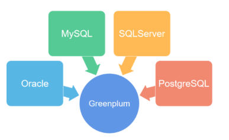
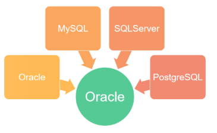
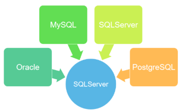
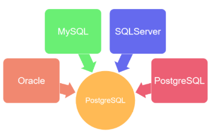
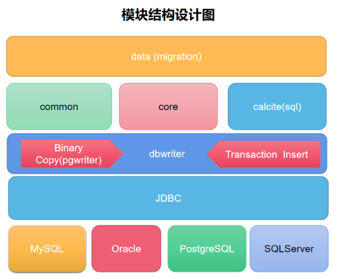

# 异构数据库数据与结构同步工具

## 一、工具介绍

### 1、功能描述

一句话，dbswitch工具提供源端数据库向目的端数据的迁移功能。迁移包括：

- **结构迁移**

字段类型、主键信息、建表语句等的转换，具有类似kettle的表输出组件生成建表SQL功能。

- **数据迁移**。

基于JDBC的fetchSize批次读取源端数据库数据，并基于insert/copy方式将数据分批次写入目的数据库。

### 2、功能设计

 
 
### 3、详细功能

- 源端oracle/SqlServer/mysql/PostgreSQL向目的端为Greenplum的迁移

 
 
- 源端oracle/SqlServer/mysql/PostgreSQL向目的端为Oralce的迁移

 
 
- 源端oracle/SqlServer/mysql/PostgreSQL向目的端为SQLServer的迁移

 
 
- 源端oracle/SqlServer/mysql/PostgreSQL向目的端为PostgreSQL的迁移

 
 
- *源端oracle/SqlServer/mysql/PostgreSQL向目的端为MySQL的迁移(测试中)*

### 4、结构设计
  
  
 
## 二、编译配置

本工具纯Java语言开发，代码中的依赖全部来自于开源项目。

### 1、编译打包

- 环境要求:

  **JDK**:>=1.8
 
  **maven**:>=3.6
 
- 编译命令:

```
git clone https://gitee.com/inrgihc/dbswitch.git
cd dbswitch/
sh ./build.sh
```

### 2、安装部署

当编译打包命令执行完成后，会在dbswitch/target/目录下生成dbswitch-relase-x.x.x.tar.gz的打包文件，将文件拷贝到已安装JRE的部署机器上解压即可。

### 3、配置文件

配置文件信息请见部署包中的：conf/config.properties

| 配置参数 | 配置说明 | 示例 | 备注 |
| :------| :------ | :------ | :------ |
| source.datasource.url | 来源端JDBC连接的URL | jdbc:oracle:thin:@10.17.1.158:1521:ORCL | 可为：oracle/mysql/sqlserver/postgresql |
| source.datasource.driver-class-name | 来源端数据库的驱动类名称 | oracle.jdbc.driver.OracleDriver | 对应数据库的驱动类 |
| source.datasource.username | 来源端连接帐号名 | tangyibo | 无 |
| source.datasource.password | 来源端连接帐号密码 | tangyibo | 无 |
| target.datasource.url | 目的端JDBC连接的URL | jdbc:postgresql://10.17.1.90:5432/study | 可为：oracle/postgresql/greenplum |
| target.datasource.driver-class-name |目的端 数据库的驱动类名称 | org.postgresql.Driver | 对应数据库的驱动类 |
| target.datasource.username | 目的端连接帐号名 | study | 无 |
| target.datasource.password | 目的端连接帐号密码 | 123456 | 无 |
| source.datasource-fetch.size | 来源端数据库查询时的fetch_size设置 | 10000 | 需要大于100有效 |
| source.datasource-source.schema | 来源端的schema名称 | ZFXFZB | 无 |
| source.datasource-source.includes | 来源端schema下的表中需要包含的表名称 | users1,orgs1 | 多个之间用英文逗号分隔 |
| source.datasource-source.excludes | 来源端schema下的表中需要过滤的表名称 | users,orgs | 不包含的表名称，多个之间用英文逗号分隔 |
| target.datasource-target.schema | 目的端的schema名称 | public | 无 |
| target.datasource-target.drop | 是否执行先drop表然后create表命令 | true | 可选值为：true、false |
| target.writer-engine.insert | 是否使用insert写入数据 | true | 可选值为：true为insert写入、false为copy写入，只针对目的端数据库为PostgreSQL/Greenplum的有效 |

 **注意:**
 
- *（1）如果source.datasource-source.includes不为空，则按照包含表的方式来执行；*

- *（2）如果source.datasource-source.includes为空，则按照source.datasource-source.excludes排除表的方式来执行。*

- mysql的驱动配置样例

```
jdbc连接地址：jdbc:mysql://172.17.2.10:3306/test?useUnicode=true&characterEncoding=utf-8&useSSL=false&zeroDateTimeBehavior=convertToNull&serverTimezone=Asia/Shanghai
jdbc驱动名称： com.mysql.cj.jdbc.Driver
```

- oracle的驱动配置样例

```
jdbc连接地址：jdbc:oracle:thin:@172.17.2.58:1521:ORCL
jdbc驱动名称：oracle.jdbc.driver.OracleDriver
```

- SqlServer的驱动配置样例

```
jdbc连接地址：jdbc:sqlserver://172.16.2.66:1433;DatabaseName=hqtest
jdbc驱动名称：com.microsoft.sqlserver.jdbc.SQLServerDriver
```

- PostgreSQL的驱动配置样例

```
jdbc连接地址：jdbc:postgresql://172.17.207.210:5432/tangyibo
jdbc驱动名称：org.postgresql.Driver
```

启动执行命令如下：
```
cd dbswitch-release-X.X.X/
bin/datasync.sh
```

## 三、特别说明

- 1、对于向目的库为PostgreSQL/Greenplum的数据离线同步默认采用copy方式写入数据，说明如下：
  
  **（a）** 如若使用copy方式写入，配置文件中需配置为postgresql的jdbcurl和驱动类（不能为greenplum的驱动包），
  
  **（b）** 如若使用insert方式写入，需要在config.properties配置文件中设置如下参数为true:

```
target.writer-engine.insert=true
```
 
- 2、dbswitch离线同步工具提供各种数据库间表结构转换RESTful类型的API接口，服务启动方式如下：
 
 ```
cd dbswitch-release-X.X.X/
bin/startup.sh
```

提供swagger在线接口文档：htttp://127.0.0.1:9088/swagger-ui.html

- 3、dbswitch离线同步工具支持的数据类型包括：整型、时间、文本、二进制等常用数据类型;

- 4、Oracle的表虽然设置了主键，如果**主键约束实际为DISABLED状态**，那在进行结构转换时会按照没有此主键处理。

## 四、文档博客

（1）https://blog.csdn.net/inrgihc/article/details/103739629

（2）https://blog.csdn.net/inrgihc/article/details/104642238

（3）https://blog.csdn.net/inrgihc/article/details/103738656

## 五、问题反馈

如果您看到或使用了本工具，或您觉得本工具对您有价值，请为此项目**点个赞**，多谢！如果您在使用时遇到了bug，欢迎在issue中反馈。也可扫描下方二维码入群讨论：（加好友请注明："程序交流"）


